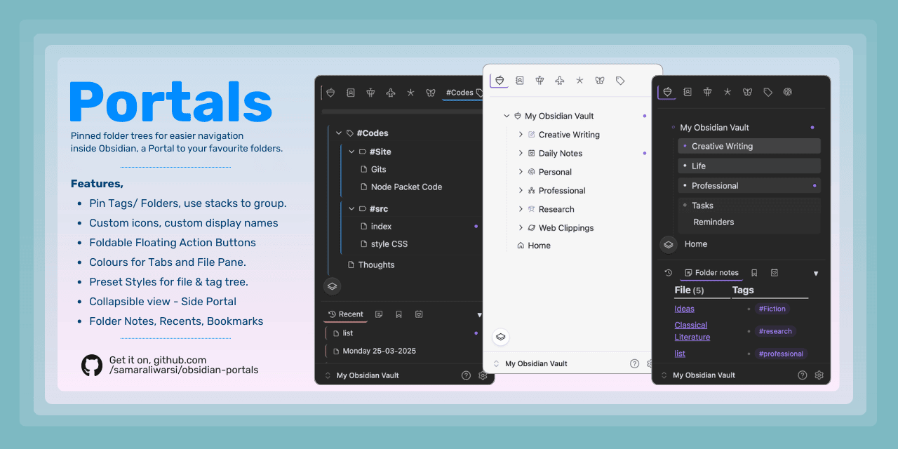
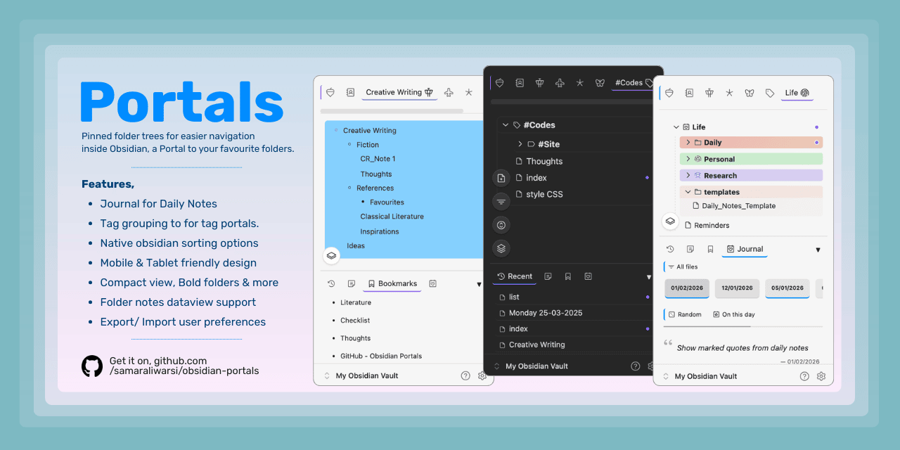

# Portals for Obsidian

<div style="display: flex; flex-wrap: wrap; gap: 6px; align-items: center;">
<a href="https://github.com/samaraliwarsi/obsidian-portals/releases"></a>
<a href="https://github.com/samaraliwarsi/obsidian-portals/releases"></a>
<a href="https://github.com/samaraliwarsi/obsidian-portals/stargazers"></a>
<a href="https://github.com/samaraliwarsi/obsidian-portals/blob/main/LICENSE"></a>
<a href="https://obsidian.md"></a>
</div>

Portals enhances your Obsidian file navigation by letting you pin any folder or tag as a customizable tab, a Portal into your selected folder trees. Add icons to Tabs, background colors, gradients and rearrange them to suit your workflow.




## ✨ Features

- **Pin folders & tags** as tabs at the top of the file pane.
- **Stacks** – group multiple tabs into collapsible stacks.
- **Custom icons & colors** – tabs, folders, files, tag groups.
- **Six visual styles** + compact tree view + bold folder names.
- **Tag grouping & subtag support** for tag portals.
- **Explorer operations** for files, folders, and tags such as multi-select, range-select, drag and reorder are all available in the plugin.
- **Command palette** to add or remove portals, configure side portals, trigger reordering etc.
- **Foldable floating action buttons** for  note/ folder creation, tag grouping, collapse and sort. 
- **Quick-add buttons** for folders, tags to quickly create new items in target items.
- **Custom display names** for tabs, stacks. 
- **Side Portal** - A modular, collapsible, resizable view containing, **Bookmarks**, **Recent Files**, **Context notes**, **Hidden**, **Properties** and **Journal**. 
	- **Context Notes** - an expansion to the older Folder notes feature. Context notes apply to folder as well as tags. 
	- **Recents** - Shows recent files list from across the vault. 
	- **Bookmarks** - Shows bookmarked files, folders or web links.
	- **Journal** - A viewing and marking tool for Daily Notes with a quote display feature. 
	- **Hidden** - Place to show files, tags and folders hidden from the main view. 
	- **Properties** - A viewing tool for markdown files, based on their properties. 
	- **Trash** - A trash explorer for notes and folders based on Obsidian's `.trash` folder at vault root. 
- **Drag & drop** reordering for portal tabs, side tabs and stacks (desktop).
- **Mobile friendly** – Responsive design that works on small screens. Tested on Android (more platforms coming).
- **Export/Import settings** – Backup your tab configuration or transfer it to another vault using json files from `Settings`.

> For a full featured guide, checkout [Portals guide](https://github.com/samaraliwarsi/obsidian-portals/blob/main/Portals_Guide.md)

> [!Note]
> - Please backup your data file after setting up preferences. You can backup by copying the file `.obsidian/plugins/portals/data.json` to safe location. You can also export the same via `Settings` and later import it. Make sure to backup before any plugin updates for safety measure. 
> - For best results,
> 	- On mobile: Works best with Baseline Theme right now as the theme renders vault on the top side. On other themes, turn off floating navigation in settings, i.e. `Settings > Appearance > Floating Navigation`. 
> 	- On desktop, you may need to turn off vault hiding if your theme hides the vault selector on the lower side. 

## ⚙️ Installation

### Using BRAT (Beta Reviewers Auto-update Tester)

1. Install the **BRAT** plugin from the Obsidian community plugins (if you haven’t already).
2. Open BRAT settings and click **Add Beta plugin**.
3. Enter the repository URL: `https://github.com/samaraliwarsi/obsidian-portals`.
4. Click **Add Plugin** – BRAT will download and enable the latest release.

### Manual installation

1. Download the latest release from the [releases page](https://github.com/samaraliwarsi/obsidian-portals/releases).
2. Extract the files into your vault’s `.obsidian/plugins/portals/` folder.
3. Enable the plugin in Obsidian settings.


## 🚀 Quick start

- First installation - use Ribbon menu or command palette to enable **Portals** view.
- Add portal tabs using settings or command palette. 
- Add **Side Portals** using settings, command palette .
- **Side Portal** can be turned off for mobile devices.
- Customise tags, stacks and folders. 

> For detailed walkthroughs and tips, read the **[Portals Guide](https://github.com/samaraliwarsi/obsidian-portals/blob/main/Portals_Guide.md)**.

## ⚙️ Settings Overview

- Explorer settings (styles, colors, compact tree, etc.)
- Side Portal (enable/disable, choose tabs)
- Context Notes (enable, tag notes folder, highlights)
- Journal (folder, date format, delimiter, quote indicators)
- Properties (current value display, filtered count)
- Stacks (icon accent, auto‑collapse, count display)
- Portal Tabs (pin vault, add/remove, customize)

>See the [Portals Guide](https://github.com/samaraliwarsi/obsidian-portals/blob/main/Portals_Guide.md) for every setting and its description.
## 🧑‍💻 Development

Clone the repository, install dependencies, and build:

```bash

git clone https://github.com/samaraliwarsi/obsidian-portals.git

cd obsidian-portals

npm install

npm run build

```

The built `main.js` and `styles.css` will be in the root folder. Copy them into your test vault’s `.obsidian/plugins/portals/` directory.
## 📝 License

This project is licensed under the MIT License. See the [LICENSE](LICENSE) file for details.

---